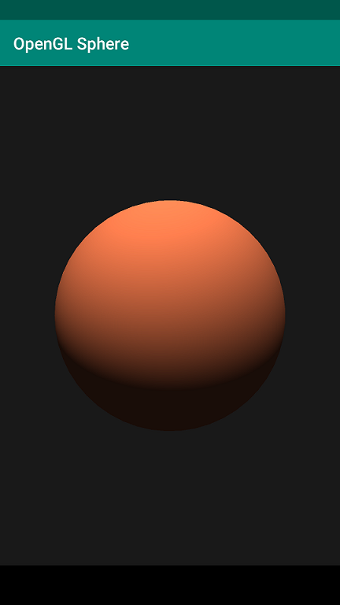

# opengl-sphere
- use opengl draw a sphere in Android jni ndk with c++
- use opengl es 3.0
- use android cmake jni config, c++ coding
- you can touch sphere to show diffrent size 

# 在安卓平台使用OpenGL画球
- 使用opengl es 3.0
- 使用android CMake jni 配置, c++编写
- 可用触摸球体观看球体不同位置

# Pic 效果图

